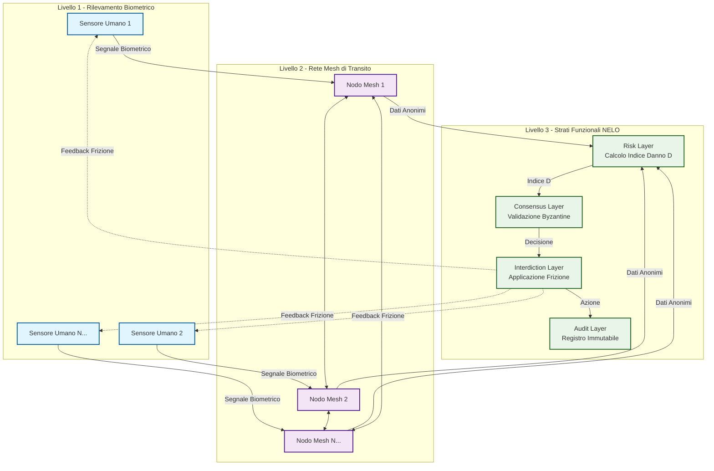

# Architettura del Protocollo NELO - Schema Concettuale

## Spiegazione dello Schema

### 1. **Livello 1 - Rilevamento Biometrico** (Cerchio Blu)
- **Cripto-Sensori Antropici** indossati dagli utenti
- Misurano segnali biologici: frequenza cardiaca, conduttanza cutanea, temperatura
- Trasmettono solo dati anonimi e cifrati
- Distruggono i dati identificativi ogni 120ms

### 2. **Livello 2 - Rete Mesh di Transito** (Cerchio Viola)
- **Nodi sacrificabili** nascosti nell'ambiente
- Ricevono dati dai sensori via Bluetooth/LoRa
- Inoltrano i dati attraverso la rete mesh
- Non memorizzano informazioni persistenti
- Autonomia energetica (solare/parassitismo)

### 3. **Livello 3 - Strati Funzionali** (Cerchio Verde)

#### **Risk Layer**
- Calcola l'**Indice di Danno D** (0.0 - 1.0)
- Formula: `D = α·G + β·(1-V) + γ·ΔT - δ`
- Dove: G = conduttanza, V = variabilità cardiaca, ΔT = gradiente termico

#### **Consensus Layer**
- **Quorum Asincrono Probabilistico**
- 127 nodi estratti casualmente
- Richiede 85 firme valide per decisioni
- Previene la cattura del sistema

#### **Interdiction Layer**
- Applica **frizione sistematica**
- Aumenta la latenza in base al valore D
- Rende le operazioni coercitive logisticamente fallimentari

#### **Audit Layer**
- Registro immutabile delle azioni
- Trasparente e verificabile
- Senza dati identificativi

## Flusso dei Dati

1. **Rilevamento** → I sensori captano segnali biometrici
2. **Trasmissione** → I nodi mesh inoltrano dati anonimi
3. **Calcolo** → Il Risk Layer calcola l'Indice D
4. **Validazione** → Il Consensus Layer conferma le decisioni
5. **Azione** → L'Interdiction Layer applica frizione
6. **Registrazione** → L'Audit Layer traccia gli eventi

## Proprietà Emergenti

- **Resistenza alla Cattura**: Nessun punto di controllo centrale
- **Privacy by Design**: Dati personali distrutti alla fonte