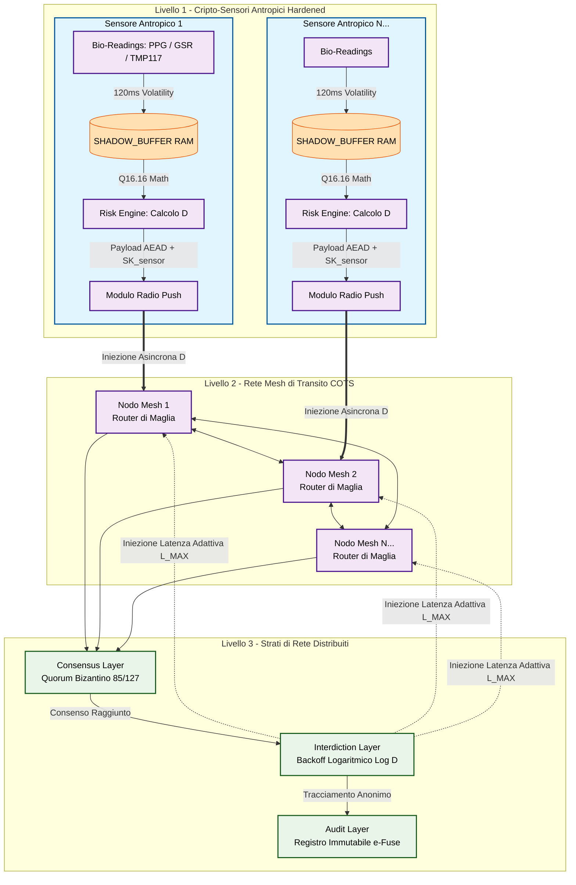
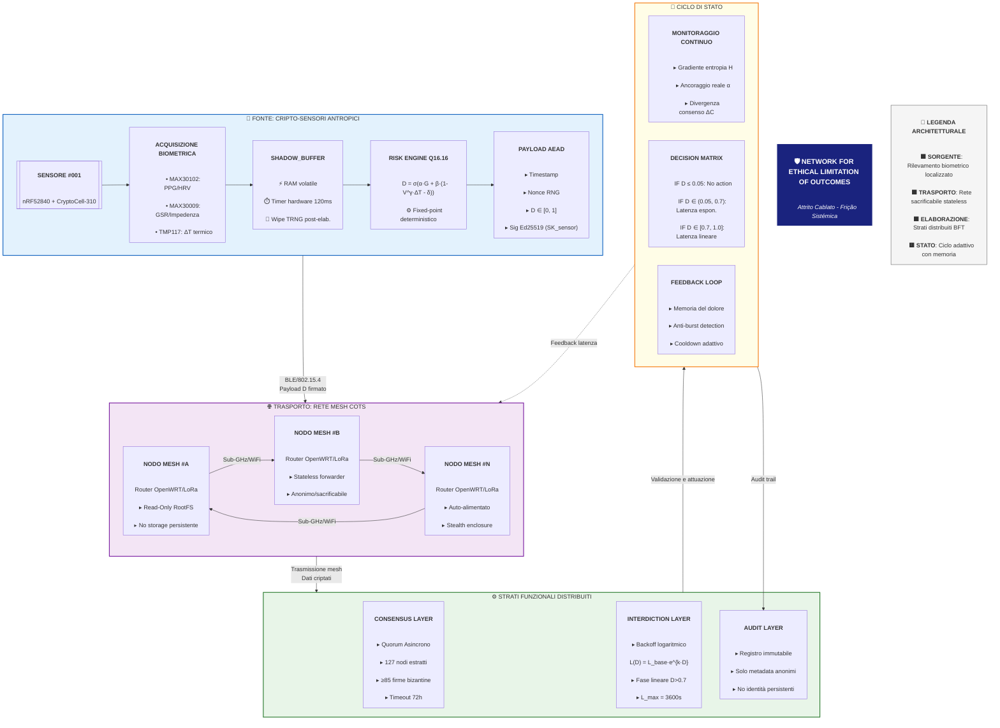

# Architettura del Protocollo NELO - Schema Concettuale


## Spiegazione dello Schema

### 1. Rilevamento e Calcolo Locale (Livello 1)
 * *Isolamento Radicale:* I dati biologici grezzi (conduttanza cutanea, HRV, temperatura in centesimi di grado) entrano nella SHADOW_BUFFER volatile.
 * *Esecuzione del Risk Engine:* La funzione nelo_calculate_d_index elabora le metriche internamente al chip. L'Indice di Danno D viene generato prima che il pacchetto tocchi l'antenna.
 * *Oblio Immediato:* Scaduto il timer hardware di 120ms, la memoria RAM viene sovrascritta con rumore casuale TRNG. La rete esterna non conoscerà mai i dati medici dell'individuo, ma solo il fattore di danno risultante D.
### 2. Instradamento COTS senza Stato (Livello 2)
 * *Involucri Anonimi:* I nodi mesh ricevono il payload crittografato contenente D firmato digitalmente con la chiave privata del sensore (SK_sensor), protetta da meccanismi hardware di anti-debugging (APPROTECT).
 * *Impossibilità di Manipolazione:* I nodi mesh fungono da meri router di transito. Non possiedono le chiavi per alterare D (pena l'invalidazione della firma) né supporti di memoria persistente (Read-Only RootFS) per registrare i transiti.
### 3. Strati di Rete e Applicazione della Frizione (Livello 3)
 * *Consensus Layer:* Quando i pacchetti viaggiano nella mesh, il protocollo estrae in modo probabilistico un pool di 127 nodi per validare l'integrità dell'evento tramite quorum bizantino (\ge 85 firme oneste).
 * *Interdiction Layer (Il vero bersaglio della Frizione):* Una volta validato un valore di D > 0.05, l'algoritmo di Backoff Logaritmico Adattivo calcola la latenza L(D). Questa latenza viene iniettata *all'interno delle code di instradamento dei Nodi Mesh (Livello 2)*. La rete rallenta se stessa, espandendo i tempi di trasmissione fino a L_MAX.
 * *Audit Layer:* Le transizioni critiche approvate dal quorum sbloccano la scrittura fisica su e-Fuse o registri non volatili immutabili distribuiti, creando una traccia crittografica dell'interdizione che esclude qualsiasi dato tracciabile o identità persistente.


# Architettura del Protocollo NELO - Schema Completo di Flusso


## **SPIEGAZIONE DETTAGLIATA DEL FLUSSO**

### **FASE 1: SORGENTE BIOMETRICA** 🟦
1. **Acquisizione hardware**: Tre sensori specializzati catturano:
   - **PPG/HRV** (variabilità cardiaca) → stress psicofisico
   - **GSR** (conduttanza cutanea) → attivazione simpatico
   - **ΔT termico** (gradiente temperatura) → shock vascolare

2. **Elaborazione locale**: 
   - I dati grezzi entrano in `SHADOW_BUFFER` (RAM volatile)
   - Vengono processati dal **Risk Engine** in virgola fissa Q16.16
   - Viene calcolato `D = sigmoid(2·G + 2.5·(1-V) + 3·ΔT - 3)`
   - **Ogni 120ms il buffer viene sovrascritto con rumore TRNG**

3. **Cifratura e firma**:
   - Il valore `D` viene firmato con la chiave privata del sensore (protetta da APPROTECT)
   - Il payload include timestamp, nonce random e firma Ed25519
   - **Zero dati identificativi persistono**

### **FASE 2: TRASPORTO MESH** 🟪
1. **Ricezione radio**: I nodi mesh catturano i pacchetti via BLE/LoRa
2. **Validazione minima**: 
   - Controllo freshness (timestamp recente)
   - Verifica nonce univoco (anti-replay)
   - **Nessuna decifratura del contenuto**
3. **Forwarding stateless**:
   - I pacchetti vengono inoltrati via mesh
   - Ogni nodo **non memorizza** dati di routing persistenti
   - File system in sola lettura (Read-Only RootFS)
4. **Caratteristiche fisiche**:
   - Hardware COTS anonimizzato (rimozione serigrafie)
   - Involucro camuffato (stealth enclosure)
   - Auto-alimentazione (solare/parassita)

### **FASE 3: ELABORAZIONE DISTRIBUITA** 🟩 - Dettaglio Tecnico

1. **CONSENSUS LAYER (Validazione Byzantine)**
Il meccanismo di consenso più robusto mai concepito per prevenire la cattura istituzionale.

#### **Algoritmo del Quorum Asincrono Probabilistico** 
```c
// PSEUDOCODICE SEMPLIFICATO DEL GATE UMANO
bool validate_protocol_change(Proposal *p) {
    // 1. SELEZIONE CASUALE DEI VALIDATORI
    Validator_Pool = extract_random_nodes(127, GLOBAL_NETWORK);
    
    // 2. FINESTRA TEMPORALE STRETTA (72h)
    Start_Timer(72_hours);
    
    // 3. RACCOLTA ASINCRONA DI FIRME
    Signatures_Collected = 0;
    while (!Timer_Expired) {
        foreach (Validator in Validator_Pool) {
            if (Validator.submits_signature(p)) {
                // VERIFICA HUMAN-IN-THE-LOOP
                if (Validator.completes_biometric_challenge() && 
                    Validator.enters_correct_OTP()) {
                    
                    Signatures_Collected++;
                    
                    // 4. SOGLIA BIZANTINA CRITICA
                    if (Signatures_Collected >= 85) {
                        // QUORUM RAGGIUNTO - GATE APERTO
                        commit_to_hardware_efuse(p);
                        return true;
                    }
                }
            }
        }
    }
    
    // 5. FALLBACK DI SICUREZZA
    if (Signatures_Collected < 64) {
        activate_emergency_lockdown();
    }
    
    return false; // CAMBIAMENTO RESPINTO
}
```

#### **Caratteristiche Critiche del Consenso**:
| Caratteristica | Spiegazione | Effetto Protettivo |
|--------------|------------|-------------------|
| **Pool di 127** | Numero di Mersenne (2⁷-1) ottimale | Supera soglia "gruppo piccolo" rendendo collusioni impraticabili |
| **Soglia 85/127** | Maggioranza qualificata (≥2/3+1) | Tolleranza bizantina: supporta fino a 42 nodi malevoli/disconnessi |
| **Human-in-the-Loop** | Challenge biometrica + OTP | Impedisce automazione/attacchi remoti - richiede azione umana conscia |
| **Finestra 72h** | Tempistica stretta | Previene attacchi "slow drip" e coordinazioni occulte |
| **Estrazione casuale** | Validatori scelti probabilisticamente | Rende impossibile corrompere in anticipo i validatori |

2. **INTERDICTION LAYER (Meccanica della Frizione)**
Il cuore operativo di NELO: trasforma il segnale `D` in attrito di rete misurabile.

#### **Funzione di Backoff Logaritmico Adattivo**:
```math
L(D) = 
\begin{cases} 
0 & \text{se } D \le 0.05 \\
L_{base} \cdot e^{k \cdot D} & \text{se } 0.05 < D \le 0.7 \\
L_{base} \cdot e^{k \cdot 0.7} + m \cdot (D - 0.7) & \text{se } D > 0.7 
\end{cases}
```

#### **Parametri di Configurazione**:
```c
#define L_BASE    0.001      // 1ms (latenza nominale)
#define K12.0       // Costante di interdizione
#define M         11985.0    // Pendenza fase lineare (ms per unità D)
#define L_MAX     3600000    // 1 ora = limite massimo assoluto
```

#### **Quadranti Operativi del Sistema**:
| Valore D | Fase | Latenza Tipica | Effetto sul Controllo di Massa |
|----------|------|----------------|--------------------------------|
| **0.00 - 0.20** | Fase Fluida | 0-15ms | Nessun impatto su operazioni legittime |
| **0.20 - 0.50** | Frizione Attiva | 15ms - 4.8s | Sincronizzazione sorveglianza degradata |
| **0.50 - 0.70** | Inerzia Sistemica | 4.8s - 120s | Catene di comando si spezzano |
| **0.70 - 1.00** | Interdizione Controllata | 120s - 3600s | Costo/bit cresce linearmente, sistema in stallo operativo |

#### **Memoria del Dolore (Cooldown Adattivo)**:
```c
// Il sistema "ricorda" gli attacchi ripetuti
float calculate_decay_factor(int burst_count) {
    float tau_base = 100.0;  // Decadimento base: 100 secondi
    float burst_factor = (burst_count > 2) ? 5.0 : 0.0;
    float alpha = 0.8;
    
    // Se rilevi pattern pulsante, la memoria si allunga
    return tau_base * (1.0 + alpha * burst_factor);
}
```

3. **AUDIT LAYER (Trasparenza Senza Identità)**
Registro immutabile che documenta le azioni senza mai compromettere la privacy.

#### **Strutt Record di Audit**:
```json
{
  "event_hash": "sha3-512 dei metadati",
  "timestamp": "2024-01-01T00:00:00Z",
  "consensus_reached": true,
  "signature_count": 92,
  "action_type": "latency_injection",
  "duration_ms": 45000,
  "risk_level": "high",
  "anomaly_pattern": "coordinated_oppression",
  "geographic_region": "hash(continent) [anonimo]",
  "data_volume_affected": "10-100GB range",
  "quorum_validators_hash": "hash(127 node IDs)"
}
```

#### **Principi di Audit NELO**:
1. **Hash, mai dati grezzi**: Solo fingerprint crittografiche
2. **Range, mai precisione**: "10-100GB" non "47.3GB"
3. **Categorie, mai identità**: "regione: Europa Nord" non "coordinate GPS"
4. **Pattern, mai individui**: "10000+ segnali stress simultanei" non "lista nomi"

4. **INVARIANTI SISTEMICHE (Monitoraggio Continuo)**
Tre metriche fondamentali che il sistema monitora per preservare la propria integrità:

**1. Gradiente di Entropia dei Nodi (H)**
```math
H = -\sum_{i=1}^{N} p_i \log_2 p_i
```
**Monitora**: Diversità e interconnessione della rete  
**Allarme**: Crollo di H → nodi si isolano per panico  
**Contromisura**: Dynamic Friction - rallenta il contagio della paura

### **2. Rapporto di Ancoraggio Reale (α)**
```math
\alpha = \frac{\text{Risorse Reali}}{\text{Valore Finanziario Derivato}}
```
**Monitora**: Distacco tra economia reale e finanza speculativa  
**Allarme**: α → 0 (bolla puramente sintattica)  
**Contromisura**: Aumento costo computazionale → "affama" i contratti ricorsivi

### **3. Divergenza di Consenso Sintattico (ΔC)**
```math
\Delta C = \frac{\text{Decisioni Esterne}}{\text{Decisioni Automatiche}}
```
**Monitora**: Tentativi di intervento manuale/eccezionale  
**Allarme**: ΔC > soglia → "stato di emergenza" dichiarato  
**Contromisura**: Firewall logici isolano il nodo deviante

## **FLUSSO COMPLETO DELLA FASE 3**:

```
[PACCHETTO D VALIDO IN ARRIVO]
        ↓
[CONSENSUS LAYER: Verifica firme ≥85/127]
        ↓
[SE VALIDO → Calcola L(D) con backoff]
        ↓
[INIEZIONE LATENZA nei router mesh]
        ↓
[AUDIT: Registra hash evento immutabile]
        ↓
[MONITORAGGIO: Aggiorna H, α, ΔC]
        ↓
[FEEDBACK: Adjust cooldown per pattern burst]
```

## **PROPRIETÀ EMERGENTI DI QUESTA FASE**:

1.	Resistenza alla Cattura: Nessun punto di controllo centrale
2.	Privacy by Design: Dati personali distrutti alla fonte

