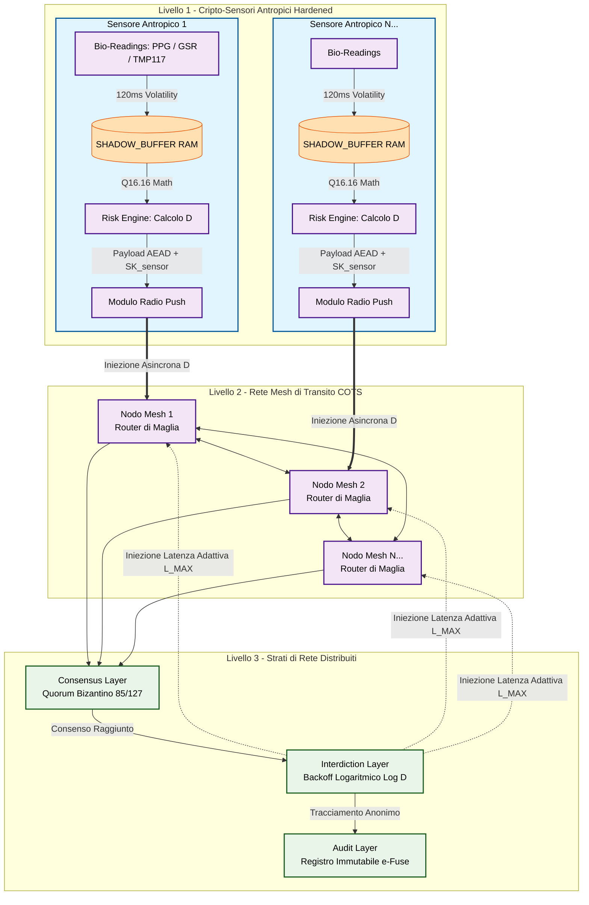

# Architettura del Protocollo NELO - Schema Concettuale

## Spiegazione dello Schema

### 1. Rilevamento e Calcolo Locale (Livello 1)
 * *Isolamento Radicale:* I dati biologici grezzi (conduttanza cutanea, HRV, temperatura in centesimi di grado) entrano nella SHADOW_BUFFER volatile.
 * *Esecuzione del Risk Engine:* La funzione nelo_calculate_d_index elabora le metriche internamente al chip. L'Indice di Danno D viene generato prima che il pacchetto tocchi l'antenna.
 * *Oblio Immediato:* Scaduto il timer hardware di 120ms, la memoria RAM viene sovrascritta con rumore casuale TRNG. La rete esterna non conoscerà mai i dati medici dell'individuo, ma solo il fattore di danno risultante D.
### 2. Instradamento COTS senza Stato (Livello 2)
 * *Involucri Anonimi:* I nodi mesh ricevono il payload crittografato contenente D firmato digitalmente con la chiave privata del sensore (SK_sensor), protetta da meccanismi hardware di anti-debugging (APPROTECT).
 * *Impossibilità di Manipolazione:* I nodi mesh fungono da meri router di transito. Non possiedono le chiavi per alterare D (pena l'invalidazione della firma) né supporti di memoria persistente (Read-Only RootFS) per registrare i transiti.
### 3. Strati di Rete e Applicazione della Frizione (Livello 3)
 * *Consensus Layer:* Quando i pacchetti viaggiano nella mesh, il protocollo estrae in modo probabilistico un pool di 127 nodi per validare l'integrità dell'evento tramite quorum bizantino (\ge 85 firme oneste).
 * *Interdiction Layer (Il vero bersaglio della Frizione):* Una volta validato un valore di D > 0.05, l'algoritmo di Backoff Logaritmico Adattivo calcola la latenza L(D). Questa latenza viene iniettata *all'interno delle code di instradamento dei Nodi Mesh (Livello 2)*. La rete rallenta se stessa, espandendo i tempi di trasmissione fino a L_MAX.
 * *Audit Layer:* Le transizioni critiche approvate dal quorum sbloccano la scrittura fisica su e-Fuse o registri non volatili immutabili distribuiti, creando una traccia crittografica dell'interdizione che esclude qualsiasi dato tracciabile o identità persistente.
## Flusso dei Dati

1. **Rilevamento** → I sensori captano segnali biometrici
2. **Trasmissione** → I nodi mesh inoltrano dati anonimi
3. **Calcolo** → Il Risk Layer calcola l'Indice D
4. **Validazione** → Il Consensus Layer conferma le decisioni
5. **Azione** → L'Interdiction Layer applica frizione
6. **Registrazione** → L'Audit Layer traccia gli eventi

## Proprietà Emergenti

- **Resistenza alla Cattura**: Nessun punto di controllo centrale
- **Privacy by Design**: Dati personali distrutti alla fonte
