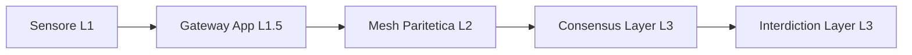

## **RFC-NELO-v3.1-HARDENED (Revisione V2.1)**

### **1. Abstract**

NELO è un’infrastruttura distribuita progettata per ridurre la scalabilità della sofferenza non consensuale attraverso meccanismi di interdizione sistemica, basata su un modello di autenticazione a doppia firma (Sensore-Gateway).

### **2. Architettura**

#### **4.1 Overview**

L'infrastruttura si articola su tre livelli di trust:



#### **4.2 Componenti**

* **4.2.1 Edge Nodes (Sensore L1):** Acquisizione biometrica, elaborazione *Risk Index* (Q16.16) e firma hardware (Ed25519) del *Segmento S*.
* **4.2.2 Gateway Mobile (L1.5):** Punto di aggregazione del contesto operativo. Inietta il *Segmento A* e appone la firma di secondo livello (App) sull'intero payload [S+A]. MUST operare in modalità stateless (nessuna persistenza biometrica).
* **4.2.3 Rete Mesh Paritetica (L2):** Insieme di nodi COTS omogenei in sola lettura (Read-Only RootFS). Operano esclusivamente come forwarder *stateless* e agenti di frizione.
* **4.2.4 Consensus Layer (L3):** Basato su quorum bizantino (85/127). Verifica la doppia firma e orchestra la latenza adattiva.

### **5. Protocolli**

#### **5.1 Protocollo di rilevamento**

Il segnale di rischio segue un percorso di autenticazione concatenata:

```
Local Analysis (Sensore) → Firma HW → Iniezione Contesto (Gateway) → Firma App → Broadcast (Mesh)

```

#### **5.2 Protocollo di interdizione**

Il *Consensus Layer* invia comandi di latenza *L(D)* alla rete mesh. I nodi manipolano dinamicamente le code di trasmissione (Traffic Shaping) per iniettare ritardi logaritmici calcolati in base all'Indice di Danno.

### **8. Hardware Constraints**

* Le chiavi di firma HW devono essere residenti in Secure Enclaves (es. CryptoCell-310).
* Il Segmento S deve mantenere dimensione fissa di 83 byte per garantire la compatibilità crittografica.
* Ogni nodo deve garantire l'autodistruzione logica dei log in caso di rilevamento intrusione fisica.

---

### **Stato del documento**

* **STATUS:** DRAFT → IMPLEMENTABLE (Allineato a V2.1)
* **MODE:** PASSIVE INTERDICTION / STATELESS MESH
* **AUTHORITY:** NONE (Decentralized Governance)
