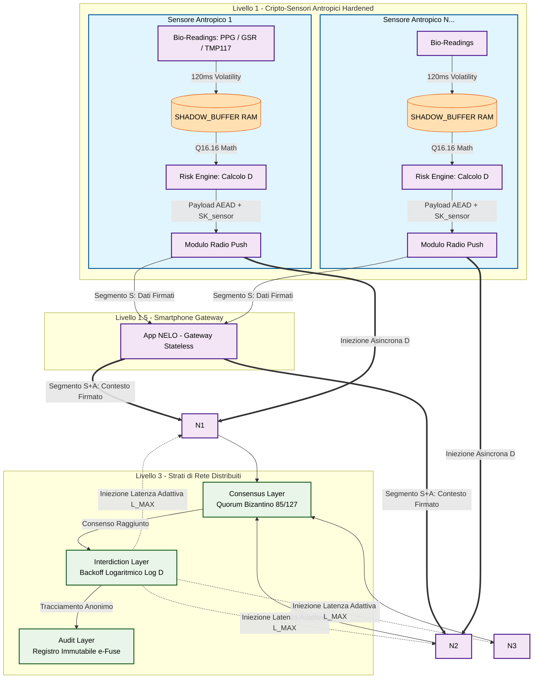
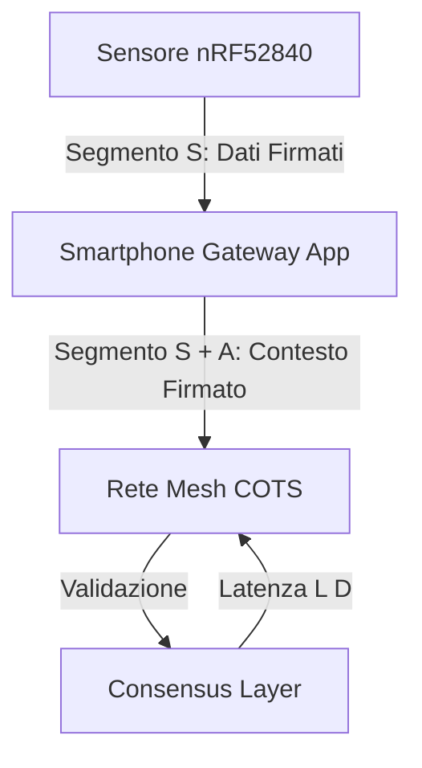
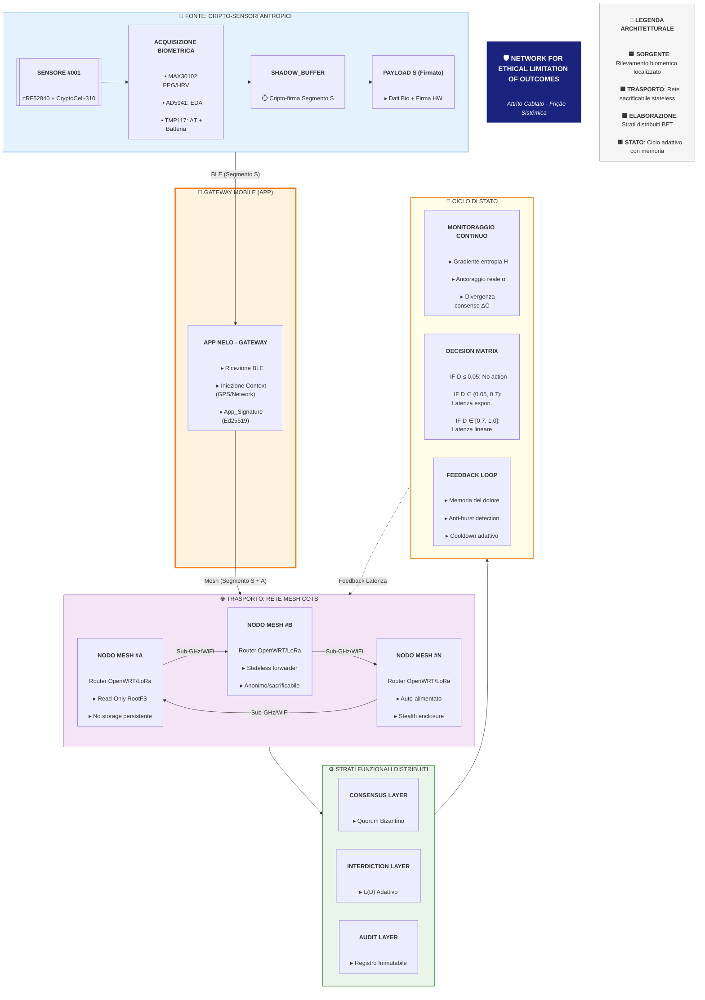
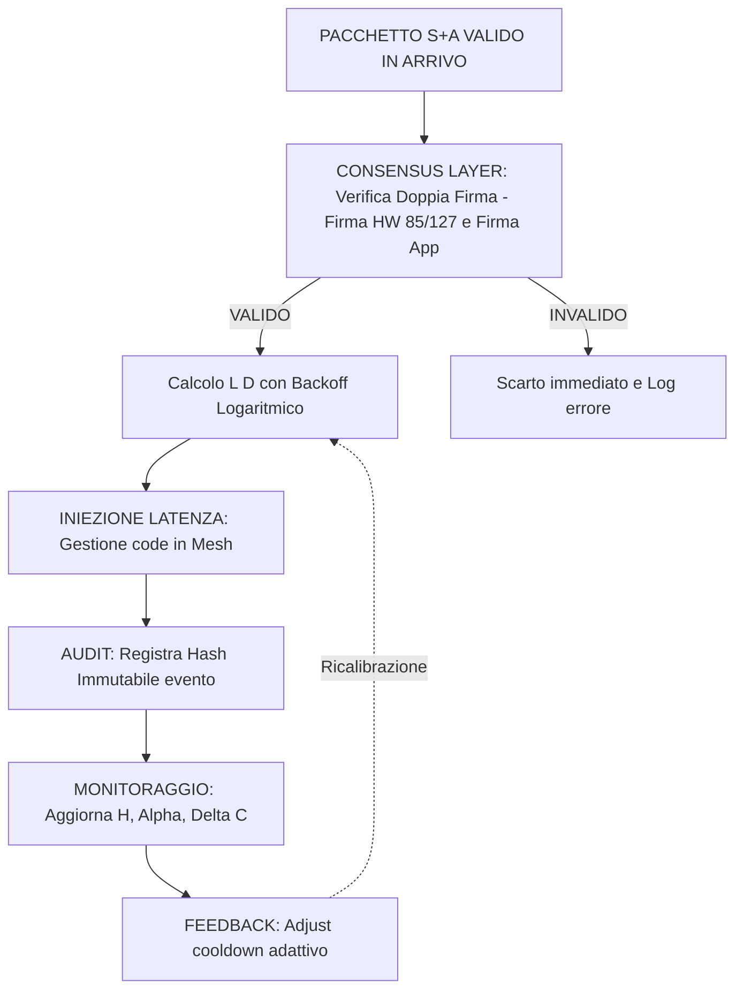

# **ARCHITETTURA DEL PROTOCOLLO NELO \- SPEC V2.0**

*Versione: 2.0 (Evolution) | Status: Operational Friction | Mode: Systemic Inertia*

## **1\. Evoluzione Architetturale**

Il protocollo NELO evolve dalla versione 1.0 (Mesh pura) alla **versione 2.0 (Hybrid Gateway-Stateless)**. Il sensore (L1) non agisce più come nodo terminale autonomo di iniezione, ma come sorgente di dati firmati che necessitano del contesto mobile (Gateway) per completare la catena di autenticazione.

### Architettura del Protocollo NELO - Schema Concettuale aggiornato

## Spiegazione dello Schema

### 1. Rilevamento e Calcolo Locale (Livello 1)
 * *Isolamento Radicale:* I dati biologici grezzi (conduttanza cutanea, HRV, temperatura in centesimi di grado) entrano nella SHADOW_BUFFER volatile.
 * *Esecuzione del Risk Engine:* La funzione nelo_calculate_d_index elabora le metriche internamente al chip. L'Indice di Danno D viene generato prima che il pacchetto tocchi l'antenna.
 * *Oblio Immediato:* Scaduto il timer hardware di 120ms, la memoria RAM viene sovrascritta con rumore casuale TRNG. La rete esterna non conoscerà mai i dati medici dell'individuo, ma solo il fattore di danno risultante D.
### 2. Instradamento COTS e Gateway Mobile (Livello 2)
* **Gateway Mobile Stateless:** Il Gateway (Smartphone/App) agisce come punto di aggregazione del contesto. Riceve il *Segmento S* (Dati Sensore) e vi appone il *Segmento A* (Contesto Operativo), firmando crittograficamente l'intero blocco prima dell'inoltro alla rete Mesh.
* **Involucri Anonimi:** I nodi mesh ricevono un payload "a doppia firma". Il primo livello (Sensore) garantisce l'integrità del dato biometrico, il secondo livello (Gateway) garantisce l'autenticità del contesto di transito.
* **Impossibilità di Manipolazione:** I nodi mesh operano esclusivamente come router *stateless* di transito. Non disponendo delle chiavi di firma né del sensore (SK_sensor) né del Gateway, qualsiasi tentativo di alterazione del valore *D* o del contesto comporterebbe l'immediata invalidazione del pacchetto, che verrebbe scartato dal *Consensus Layer*. La persistenza è nulla (Read-Only RootFS), eliminando ogni traccia del transito.
### 3. Strati di Rete e Applicazione della Frizione (Livello 3)
 * *Consensus Layer:* Quando i pacchetti viaggiano nella mesh, il protocollo estrae in modo probabilistico un pool di 127 nodi per validare l'integrità dell'evento tramite quorum bizantino (\ge 85 firme oneste).
 * *Interdiction Layer (Il vero bersaglio della Frizione):* Una volta validato un valore di D > 0.05, l'algoritmo di Backoff Logaritmico Adattivo calcola la latenza L(D). Questa latenza viene iniettata *all'interno delle code di instradamento dei Nodi Mesh (Livello 2)*. La rete rallenta se stessa, espandendo i tempi di trasmissione fino a L_MAX.
 * *Audit Layer:* Le transizioni critiche approvate dal quorum sbloccano la scrittura fisica su e-Fuse o registri non volatili immutabili distribuiti, creando una traccia crittografica dell'interdizione che esclude qualsiasi dato tracciabile o identità persistente.

## **2\. Payload di Comunicazione (Payload AEAD V2)**

Il pacchetto è ora suddiviso in due segmenti interdipendenti, garantendo una firma a due livelli:

### **2.1 Segmento S (Sensore \- Source)**

Prodotto dal firmware (nRF52840) e firmato tramite *CryptoCell-310* (Ed25519).

* **Dimensione:** 83 byte (fisso).  
* **Struttura:** \[timestamp (4b)\]\[damage\_index (2b)\]\[temperature (2b)\]\[bpm (1b)\]\[spo2 (1b)\]\[battery (1b)\]\[eda\_data (8b)\]\[signature\_hw (64b)\].

### **2.2 Segmento A (App \- Contextual)**

Aggiunto dal Gateway Mobile (App) prima dell'inoltro alla rete Mesh.

* **gw\_node\_id:** UUID univoco del dispositivo mobile.  
* **context\_flags:** Bitmask (WiFi, Roaming, Cell, Location\_Precision).  
* **app\_signature:** Firma Ed25519 del blocco concatenato \[Segmento S \+ Segmento A\].

## **3\. Schema di Flusso Aggiornato (V2.0)**

### ** 3.1 Schema completo di flusso aggiornato

## **SPIEGAZIONE DETTAGLIATA DEL FLUSSO (V2.0)**

### **FASE 1: SORGENTE BIOMETRICA (L1)** 🟦

1. **Acquisizione hardware**:
* **PPG/HRV** (frequenza cardiaca e saturazione SpO2)
* **GSR/AD5941** (bioimpedenza cutanea)
* **TMP117** (temperatura di precisione)
* **ADC integrato** (livello carica batteria per pianificazione resilienza)

2. **Elaborazione locale**:
* I dati entrano in `SHADOW_BUFFER` (RAM volatile).
* Processamento tramite **Risk Engine** (Q16.16) per il calcolo dell'Indice di Danno $D_{v2}$.
* **Oblio hardware**: Ogni 120ms il buffer viene sovrascritto con rumore TRNG (Hardware True Random Number Generator).

3. **Firma parziale**:
* Il firmware genera il **Segmento S** (83 byte).
* Firma del Segmento S con la chiave privata `SK_sensor` (Hardware-backed CryptoCell-310).
* **Risultato**: Dato biometrico certificato alla fonte, immodificabile.

### **FASE 1.5: GATEWAY MOBILE (APP)** 🟧

1. **Aggregazione**: Lo smartphone riceve il Segmento S via BLE (MTU esteso).
2. **Arricchimento contestuale**: L'App inietta il **Segmento A**:
* `gw_node_id`: Identificativo del Gateway.
* `context_flags`: Bitmask su rete (WiFi, 4G, Roaming, posizione stimata).

3. **Firma a due livelli**:
* L'App appone una seconda firma (Ed25519) sull'intero blocco `[Segmento S + Segmento A]`.
* L'App agisce come **Gateway Stateless**: non memorizza le biometriche, ma garantisce che il pacchetto sia contestualizzato correttamente per la rete Mesh.

### **FASE 2: TRASPORTO MESH (L2)** 🟪

1. **Ricezione radio**: I nodi mesh ricevono il pacchetto a doppia firma.
2. **Validazione di rete**:
* Controllo crittografico (firma HW + firma App).
* Controllo validità nonce e timestamp contro tentativi di *replay attack*.
* **Forwarding stateless**: Il pacchetto viene instradato verso il *Consensus Layer*.

3. **Integrità del transito**:
* I nodi sono meri forwarder privi di chiavi di decodifica.
* Assenza totale di memoria persistente: se il nodo viene sequestrato, non contiene alcuna traccia dei pacchetti in transito.

4. **Hardware COTS**:
* Operatività in modalità *stealth* su router con `Read-Only RootFS`.
* Capacità di autodistruzione logica dei log in caso di rilevamento intrusione.

### **FASE 3: ELABORAZIONE DISTRIBUITA** 🟩 - Dettaglio Tecnico aggiornato

## **4\. Risk Engine V2 (Integrazione Biometrica)**

Il calcolo di *D* (Indice di Danno) è stato aggiornato per includere la variabilità dell'ossigenazione sanguigna (SpO2) misurata dal MAX30102:  
*Dv2 \= σ(α·G \+ β·(1 \- HRVnorm) \+ γ·ΔT \+ δ·(1 \- SpO2norm))*  
Il fattore δ (SpO2) normalizza l'indice di sofferenza, rendendo il quorum più sensibile a cali di saturazione ossigeno improvvisi.
